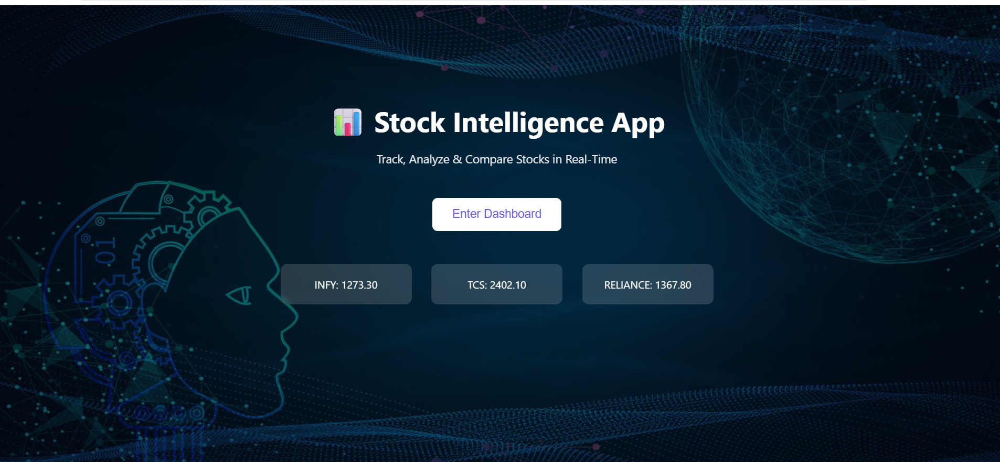
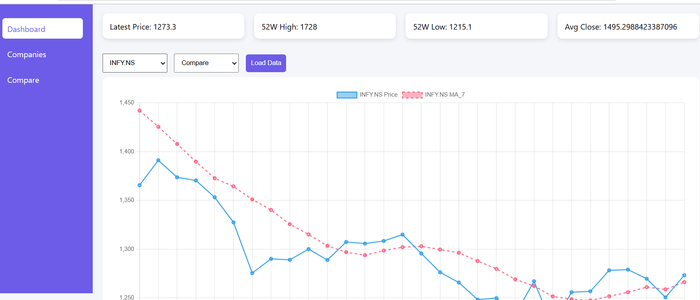
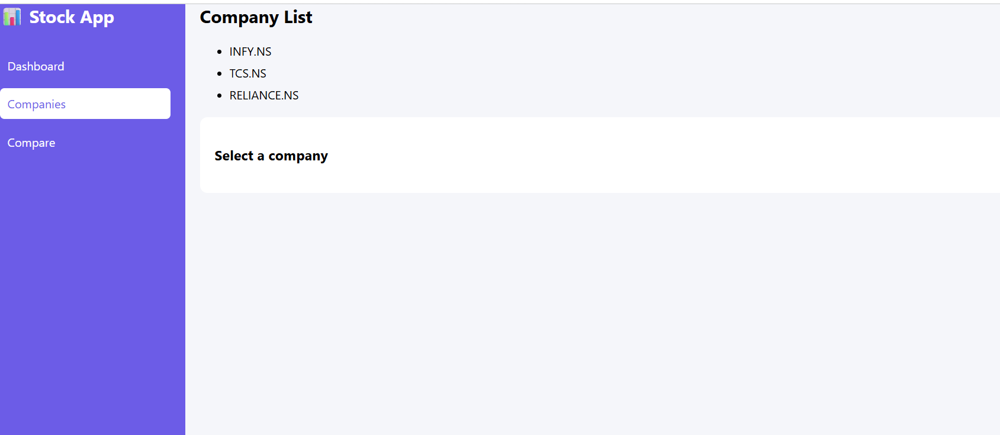
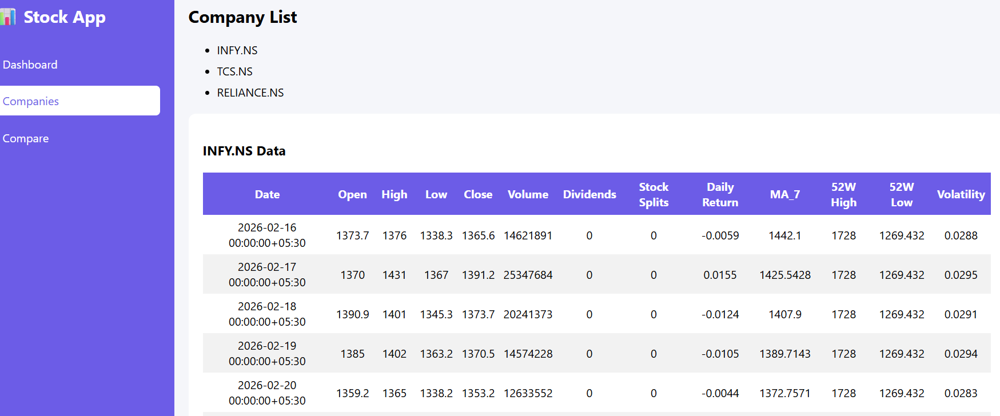
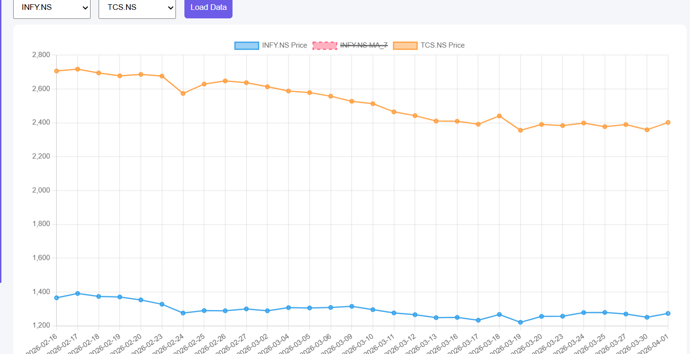

#  Stock Data Intelligence

A full-stack stock analysis web application that allows users to **fetch, analyze, visualize, and compare stock market data** in real-time.

# Features

>  Fetch stock data using API
>  Data cleaning & preprocessing
>  Interactive charts using Chart.js
>  Technical indicators:

  * Daily Return
  * 7-Day Moving Average (MA_7)
  * 52-Week High & Low
  * Volatility
>  Compare two companies
>  Company list with CSV preview
>  Modern dashboard UI
>  REST API using FastAPI

# Project Structure

Stock-Data-Intelligence/
│
├── data/
│   ├── data_fetch.py
│   ├── INFY.NS_clean.csv
│   ├── TCS.NS_clean.csv
│   └── RELIANCE.NS_clean.csv
│
├── frontend/
│   ├── index.html
│   ├── main.html
│   └── images/
│       └── stock intelligence bg.jpg
│
├── app.py
├── requirements.txt
└── README.md

# Backend

* Python
* FastAPI
* Pandas
* yfinance

# Frontend

* HTML
* CSS
* JavaScript
* Chart.js

# Installation & Setup

# Clone the repository
https://github.com/mahesh4567-0/stock-intelligence-app.git)
cd stock-data-intelligence

# Install dependencies

pip install -r requirements.txt

###  Run Backend Server

>>uvicorn app:app --reload

>> Server will start at:

http://127.0.0.1:8000

# Open Frontend

Open in browser:

frontend/main.html

# API Endpoints

| Endpoint            > Description           |
| `/companies`        > Get list of companies |
| `/data/{symbol}`    > Get stock data        |
| `/summary/{symbol}` > Get summary stats     |

# Example Companies

* INFY.NS (Infosys)
* TCS.NS (Tata Consultancy Services)
* RELIANCE.NS (Reliance Industries)

# Data Processing
  > Fetch stock data using yfinance
  >Clean data:
              Remove duplicates
              Handle missing values
 > Add metrics:
              Daily Return
              Moving Average (MA_7)
              52 Week High/Low
              Volatility

# Tech Stack
  >Backend: FastAPI
  >Frontend: HTML, CSS, JS
  >Charts: Chart.js
  >Data: yFinance, Pandas
  >Deployment: Render + Netlify

# Future Improvements

*  User login system
*  Mobile responsive UI
*  Cloud deployment
*  More indicators (RSI, MACD)
*  Stock alerts

Deployment

* Backend → Render / Railway >>> https://stock-intelligence-app-sn60.onrender.com
* Frontend → Netlify / >> https://stockintelligences.netlify.app/

# Author

Developed by **Mahesh**
# step 1 flow 

User → Frontend (Netlify)
↓
Fetch API call
↓
Backend (Render / FastAPI)
↓
Fetch stock data (yfinance)
↓
Clean + process data (Pandas)
↓
Return JSON
↓
Frontend charts update

# Step2 : Clean
  >>Remove duplicates
  >>Convert date
  >>Fill missing values
# Step : 3 Add Matrix
  >>Clean
  >>Remove duplicates
  >>Convert date
  >>Fill missing values
# Step 4 : API returns JSON

# Frountend Logic
User selects stock
JS calls API
Data converted → arrays
Chart.js renders:
 >>Price line
 >>MA_7 line
Cards show summary

## INSIGHTS

# Moving Average (MA_7)
1. Smooths price fluctuations
2. Helps identify trend

 >> If price > MA → Uptrend
 >> If price < MA → Downtrend

# Volatility
1. Measures risk
2. High volatility = unstable stock
 Investors use it for risk analysis
 
 # Daily Return
  >>(Close - Open) / Open

  >>Shows daily performance

  # Real Insight Example
  If:
  >>INFY MA rising
  >>Low volatility 

>>Stable growth stock